# Network Monitoring Dashboard
## Prometheus + Node Exporter + Grafana

## Project Summary
This project demonstrates how to build a real-time network monitoring dashboard using open-source observability tools.

The implementation collects host and network metrics with Prometheus and Node Exporter, then visualizes them in Grafana dashboards for analysis.

The dashboard covers:
- Incoming and outgoing network traffic
- Packet rates
- Network errors
- CPU and memory usage
- Interface-level utilization trends

## Objectives
- Monitor network traffic in real time
- Visualize interface bandwidth usage
- Track packet transmission rates
- Detect receive/transmit errors
- Monitor system resource usage (CPU, memory)
- Build a clean Grafana dashboard for operational visibility

## Lab Architecture
### Architecture Overview
1. Node Exporter runs on the monitored host and exposes system/network metrics.
2. Prometheus scrapes metrics endpoints over HTTP.
3. Prometheus stores time-series data.
4. Grafana queries Prometheus and visualizes the data in dashboards.

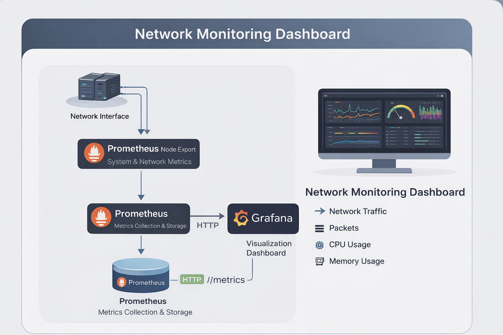

## Components
- OS: Ubuntu Linux
- Prometheus: Metrics collection and storage
- Node Exporter: Host and network metric exporter
- Grafana: Dashboard and visualization layer

## Network Interfaces Monitored
Two interfaces are monitored in this setup:
- `enp0s3`
- `enp0s8`

A dashboard variable (`$interface`) is used to switch interfaces dynamically in selected panels.

## Installation and Setup
### Install Prometheus
```bash
sudo apt update
sudo apt install prometheus -y
sudo systemctl start prometheus
sudo systemctl enable prometheus
sudo systemctl status prometheus
```

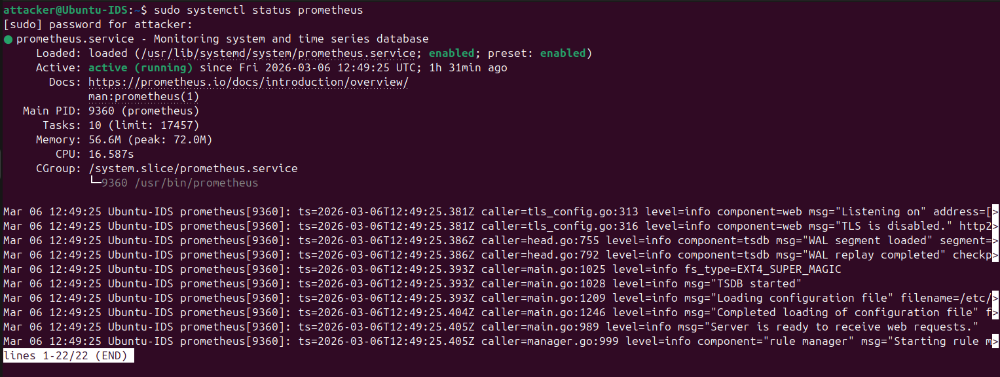

### Install Node Exporter
```bash
sudo apt install prometheus-node-exporter -y
sudo systemctl start prometheus-node-exporter
sudo systemctl enable prometheus-node-exporter
sudo systemctl status prometheus-node-exporter
```

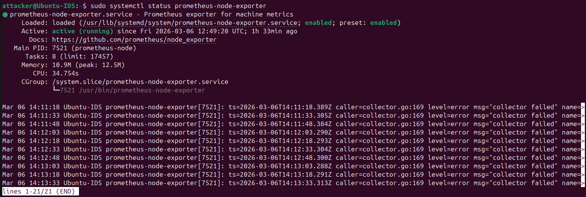

### Metrics Endpoint Validation
Prometheus endpoint:
- `http://localhost:9090/metrics`

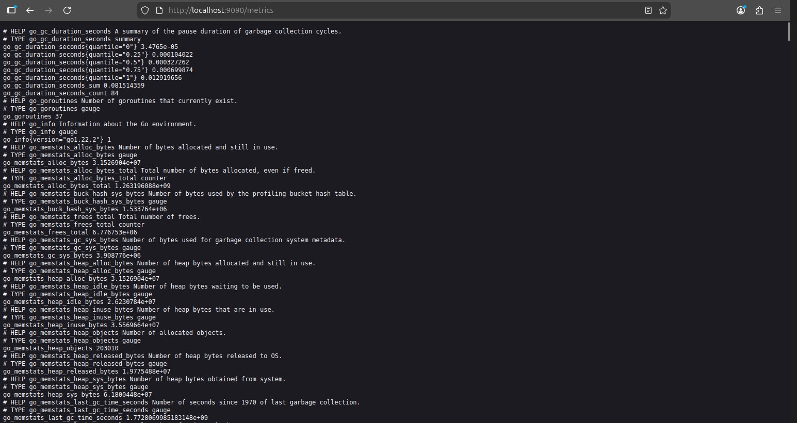

### Install Grafana
```bash
sudo apt install grafana -y
sudo systemctl start grafana-server
sudo systemctl enable grafana-server
sudo systemctl status grafana-server
```

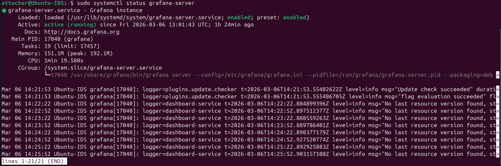

Grafana UI:
- `http://localhost:3000`

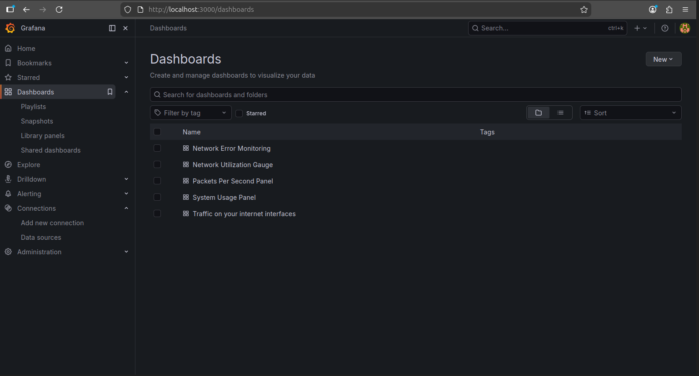

## Dashboard Panels Implemented
### Network Monitoring Panels
- Incoming traffic (per interface)
- Outgoing traffic (per interface)
- Traffic comparison between interfaces

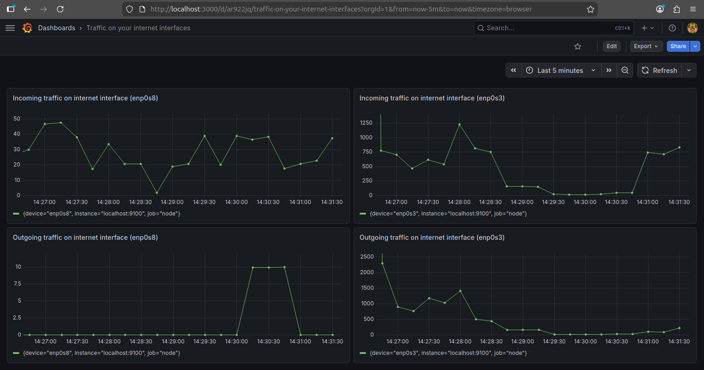

### Packet Monitoring Panel
- Incoming packet rate
- Outgoing packet rate

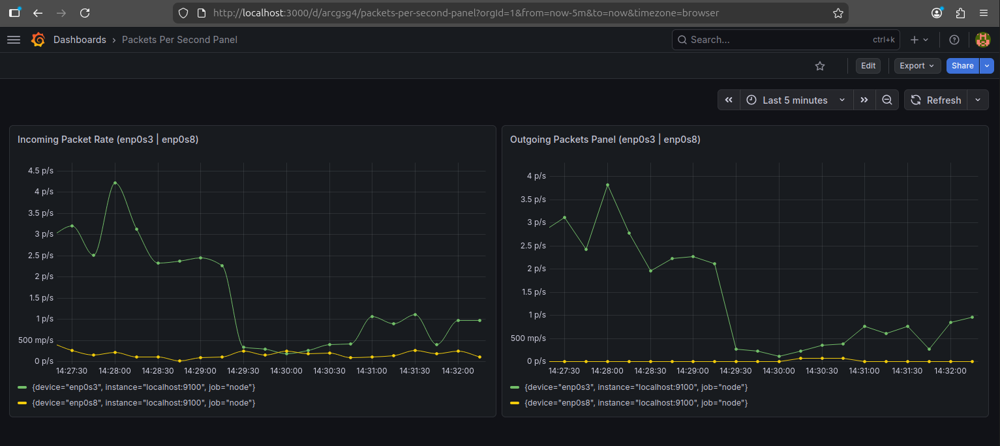

### Network Error Monitoring Panel
- Receive errors across interfaces
- Transmit errors across interfaces

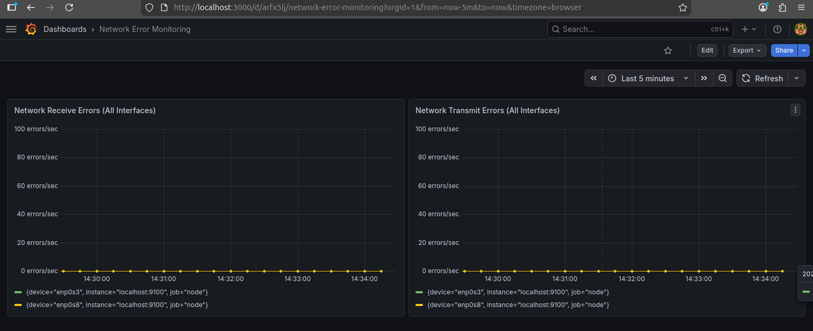

### System Monitoring Panel
- CPU usage
- Memory usage

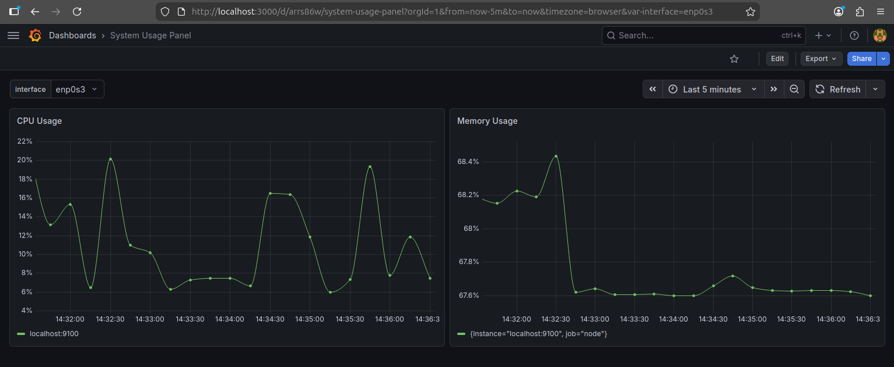

### Advanced Visualization
- Interface-specific utilization gauge/trend visualization

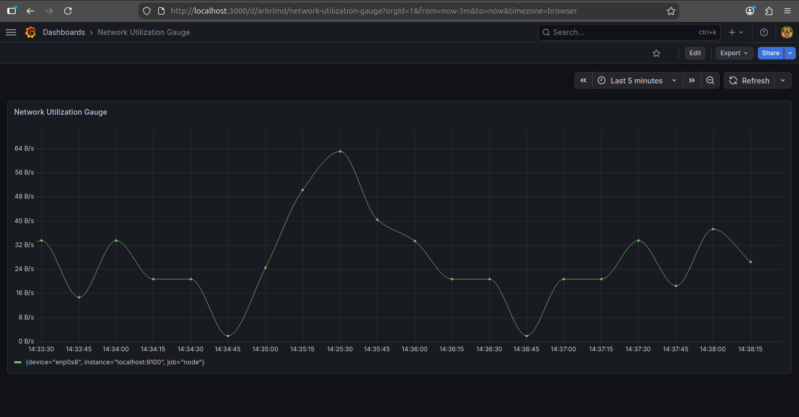

## Example Prometheus Queries
### Incoming Network Traffic
```promql
rate(node_network_receive_bytes_total{device="$interface"}[1m])
```

### Outgoing Network Traffic
```promql
rate(node_network_transmit_bytes_total{device="$interface"}[1m])
```

### Incoming Packet Rate
```promql
rate(node_network_receive_packets_total{device="$interface"}[1m])
```

### Outgoing Packet Rate
```promql
rate(node_network_transmit_packets_total{device="$interface"}[1m])
```

### CPU Usage
```promql
100 - (avg by(instance)(irate(node_cpu_seconds_total{mode="idle"}[5m])) * 100)
```

### Memory Usage
```promql
(node_memory_MemTotal_bytes - node_memory_MemAvailable_bytes)
/ node_memory_MemTotal_bytes * 100
```

### Network Errors
```promql
rate(node_network_receive_errs_total[1m])
rate(node_network_transmit_errs_total[1m])
```

## Testing the Monitoring System
Generate traffic to validate live dashboard updates:

```bash
ping -f google.com
wget http://speedtest.tele2.net/100MB.zip
```

These commands create traffic spikes that appear in the network and packet panels.

## Results
The dashboard successfully visualizes:
- Real-time bandwidth trends
- Packet activity over time
- Interface-specific network behavior
- Network error rates
- Host CPU and memory utilization

## Documentation
- Project report (original DOCX): `docs/network-monitoring-dashboard-prometheus-grafana.docx`

## Skills Demonstrated
- Linux service deployment and validation
- Prometheus metric scraping and query design
- Grafana panel/dashboard creation
- Network observability and troubleshooting
- Real-time monitoring validation

## Conclusion
This implementation provides a practical real-time monitoring stack for network and system visibility. Prometheus and Node Exporter deliver reliable metric collection, while Grafana provides clear dashboards for operations and analysis.

## Future Improvements
- Add alerting for bandwidth spikes and error thresholds
- Monitor multiple hosts with Prometheus targets
- Add dashboard annotations for incident timelines
- Integrate alert routing (email/Slack/webhook)
- Add long-term storage and retention tuning
